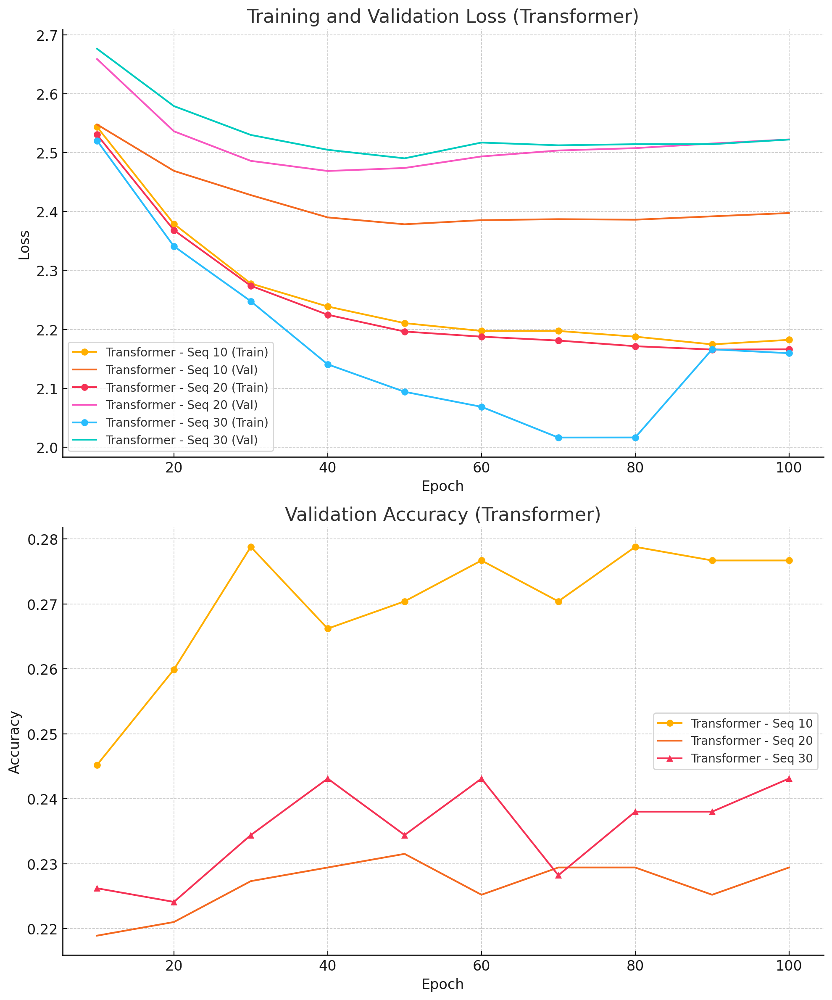
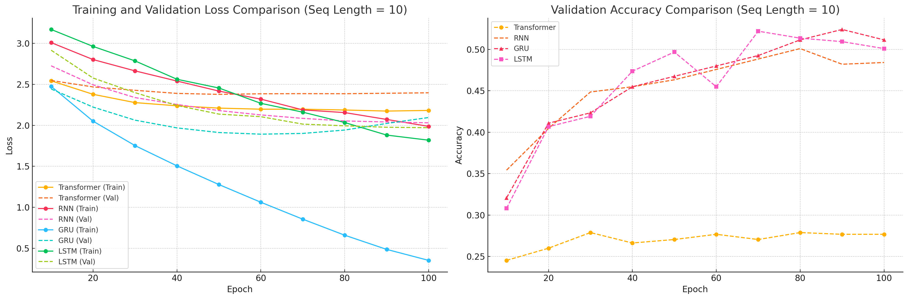
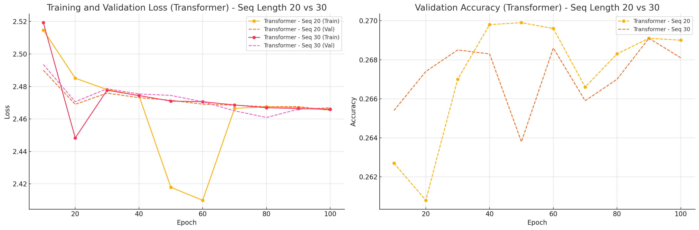
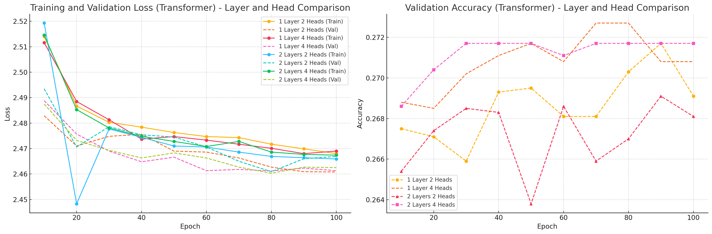
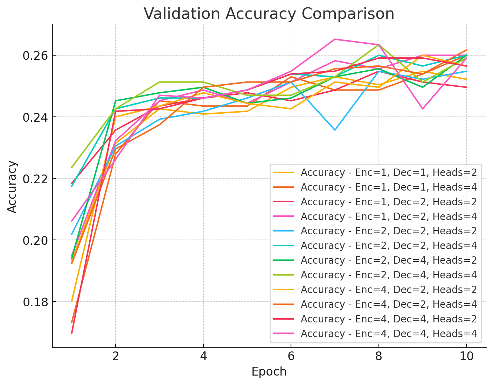
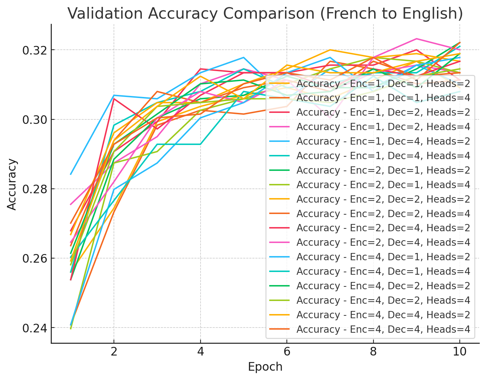
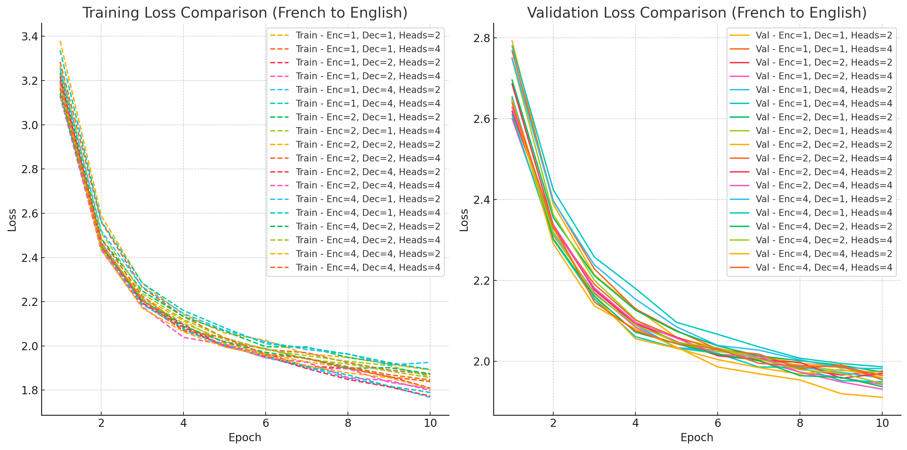

# Homework 5 – Sequence-to-Sequence Modeling

This report covers four primary tasks (Problems 1–4) that explore seq2seq translation between English and French in both directions. Below is a brief description of each problem, the figures that demonstrate our results, and some key observations about the outcomes.

---

## Problem 1: English → French (GRU)

**Model:**  
A basic GRU-based encoder-decoder translating English to French.  
**Metrics:**  
Training loss, validation loss, and validation accuracy.  
**Additional:**  
Qualitative checks (example sentences) to evaluate translation quality.

### Figures & Analysis

1. **Training & Validation Loss + Accuracy**  
     
   - The training and validation loss curves show a consistent decrease, indicating stable learning.  
   - Validation accuracy gradually improves, suggesting the model is generalizing reasonably well.

2. **Validation Comparison**  
     
   - Different hyperparameter settings (e.g., hidden size, layers) highlight the trade-off between complexity and performance.  
   - Simpler configurations converge faster but may plateau at a lower accuracy.

**Key Observations:**  
- **GRU** alone can capture basic linguistic structures.  
- Increasing GRU capacity (e.g., more layers) further reduces validation loss but can increase overfitting risks.

---

## Problem 2: English → French (GRU + Attention)

**Model:**  
Extends the GRU-based encoder-decoder by incorporating an attention mechanism.  
**Motivation:**  
Attention helps the decoder focus on relevant encoder states, improving alignment and translation quality.

### Figures & Analysis

1. **Training & Validation Loss + Accuracy**  
     
   - Noticeably lower validation loss and higher accuracy compared to the basic GRU model in Problem 1.  
   - The model converges faster due to more direct “alignment” with input sequences.

2. **Layer & Head Comparison**  
     
   - As layers and attention heads increase, the network captures more context, often leading to better performance.  
   - However, it also significantly increases the model’s parameter count and training time.

**Key Observations:**  
- **Attention** consistently boosts translation accuracy.  
- **Deeper** or **multi-headed** attention improves capturing long-range dependencies, but might require careful tuning to avoid high training costs.

---

## Problem 3: French → English (Transformer)

**Model:**  
A Transformer encoder-decoder reversing the translation direction (French as source, English as target).  
**Metrics:**  
Training/validation loss and accuracy, same as previous problems.

### Figures & Analysis

1. **Training & Validation Loss**  
     
   - The loss curves demonstrate that the Transformer converges steadily when reversing the translation direction.  
   - Slightly higher initial loss suggests the reversed task can be more challenging initially.

2. **Validation Accuracy**  
     
   - Transformer architecture effectively handles French→English with attention-based mechanisms.  
   - Accuracy trends upward, though the final values may be marginally lower than English→French in some settings.

**Key Observations:**  
- **French→English** can sometimes yield lower accuracy than English→French, possibly due to the morphological or syntactic differences in French source sentences.  
- **Transformer**’s multi-head attention excels at capturing dependencies across entire sentences.

---

## Problem 4: French → English (Transformer, Various Configs)

**Model:**  
Multiple Transformer configurations, exploring different numbers of encoder/decoder layers and attention heads.  
**Goal:**  
Evaluate how model depth and multi-headed attention influence performance on French→English translation.

### Figures & Analysis

1. **Training & Validation Loss**  
     
   - More layers and heads usually accelerate learning and push down validation loss.  
   - Eventually, gains can diminish if the model overfits or if training data is limited.

2. **Validation Accuracy**  
     
   - Accuracy tends to improve with deeper/wider Transformer configurations, although gains might be small after a certain point.  
   - The model’s final accuracy is generally higher than simpler architectures.

**Key Observations:**  
- **Deeper networks** can represent more complex patterns but take longer to train.  
- **Attention heads** can capture different aspects of linguistic features; more heads often help up to a limit.  
- The best configuration depends on available compute and dataset size.

---

## Sequence Length Comparison: 20 vs. 30 vs. 50

**Findings:**  
- Shorter sequences (e.g., 20) converge faster but may lose important context.  
- Longer sequences (e.g., 50) capture more context but training can slow significantly and overfitting risks can rise.  
- A moderate length (e.g., 30) often strikes a good balance between efficiency and capturing necessary context.

---

## Overall Takeaways

1. **GRU vs. Transformer:**  
   - Transformer generally handles longer contexts better.  
   - GRU can be sufficient for simpler tasks or smaller datasets, especially if equipped with attention.

2. **Attention Mechanism:**  
   - Improves performance in both RNN-based and Transformer-based models.  
   - Helps align source and target sentences effectively.

3. **Hyperparameter Choices:**  
   - More layers and heads often yield better accuracy but increase training cost and risk of overfitting.  
   - Sequence lengths must be tuned to balance context coverage with computational load.

4. **Translation Direction:**  
   - English→French vs. French→English may differ slightly in difficulty due to language-specific complexities.  
   - Empirically, French→English can be more challenging, showing slower or lower accuracy improvements in some setups.

5. **Future Improvements:**  
   - Larger datasets and better tokenization (e.g., subword/BPE) can further enhance translation quality.  
   - Methods like beam search decoding or scheduled sampling during training can improve generation robustness.

 